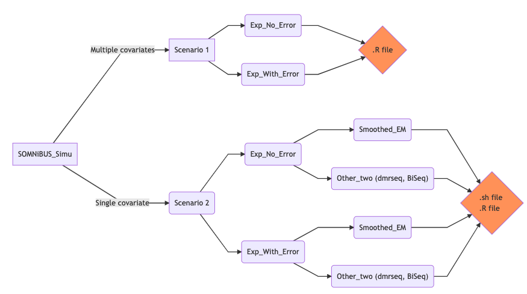
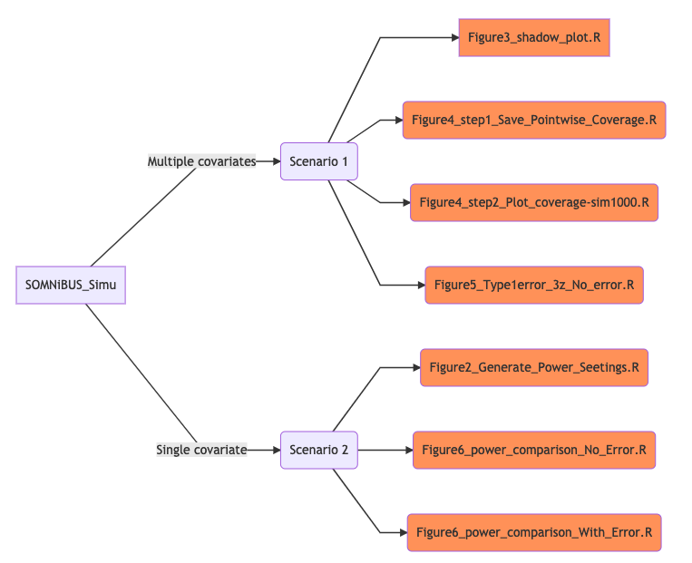

# SOMNiBUS_Simu: SmOoth ModeliNg of BisUlfite Sequencing (Simulation code)

This repository documents the code supporting the computational findings in the article “A novel statistical method for modeling covariate effects in bisulfite sequencing derived measures of DNA methylation, Zhao, K. et.al (2019) *submitted*”, and describes how to reproduce the simulation results displayed in Figures 2-6 in the paper.

## Instructions for use

### Step 1: Run the R or bash Scripts

To reproduce our simulation study from the very beginning, one can first execute the R scripts and/or bash files under the folders illustrated in the above flowchart. In a nutshell, we conducted the simulation experiments under two scenarios (Scenario 1 and 2), and we considered the settings corresponding to whether or not the data were generated to be subject to error (Experiment with error--"Exp_With_Error" or without error --"Exp_No_Error"), under each scenario. In addition, different sample sizes, and number of simulation replications were explored for each setting, which leads to multiple R or bash files under the mentioned folders. Three analytical methods, our proposed Smoothed-EM approach, dmrseq and BiSeq were applied in each simulated data set.

The outputs from all the R and bash files have been saved under their corresponding folders. Therefore, one can also reproduce Figures 2-6 by taking the following step 2 only.

### Step 2: Reproduce the Figures

Compiling the R scriptes with name "Figure*****" can directly produce Figures 2-6 in the article. The above diagram illustrates where to find the R scripts to reproduce each figure. 

## Credit

We make use of the following packages in the simulation study

* [`mgcv`](https://cran.r-project.org/web/packages/mgcv/index.html)
* [`bsseq`](https://www.bioconductor.org/packages/release/bioc/html/bsseq.html)
* [`dmrseq`](https://bioconductor.org/packages/release/bioc/html/dmrseq.html)
* [`BiSeq`](http://bioconductor.org/packages/release/bioc/html/BiSeq.html)
* [`globaltest`](https://bioconductor.org/packages/release/bioc/html/globaltest.html)
* [`Matrix`](https://cran.r-project.org/web/packages/Matrix/index.html)

## Learn more

More details of the **SOMNiBUS** method and the simulation design can be found in the manuscript

> A novel statistical method for modeling covariate effects in bisulfite sequencing derived measures of DNA methylation
> Zhao, K. et.al 
> *submitted*, 2019.

